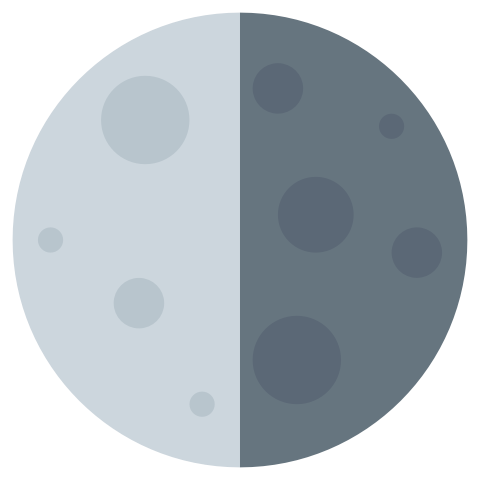

# LunaSVG

lunasvg is a standalone SVG rendering library in C++.



## Example

```cpp
#include <lunasvg/document.h>

using namespace lunasvg;

int main()
{
    auto document = Document::loadFromFile("tiger.svg");
    auto bitmap = document->renderToBitmap();

    // do something useful with the bitmap here.

    return 0;
}

```

## Features

- Basic Shapes : rect, circle, ellipse, line, polyline, polygon, path.
- Paint Servers : solidColor, linearGradient, radialGradient, pattern.
- Clipping, Masking and Compositing : clipPath, mask, group opacity.
- Document Structures: defs, svg, g, use, symbol.
- Coordinate Systems, Transformations and Units.
- Markers.
- Texts (TODO)
- Animations (TODO)
- Filters (TODO)
- Image (TODO)
- StyleSheet (TODO)

## Build

Create a build directory.
```
mkdir build
```
Run cmake command inside build directory.
```
cd build
cmake ..
```
Run make to build lunasvg.

```
make -j 2
```
To install lunasvg library.

```
make install
```

## Demo

While building lunasvg example it generates a simple SVG to PNG converter which can be used to convert SVG file to PNG file.

Run Demo.
```
svg2png [filename] [resolution] [bgColor]
```

## Support

If you like the work lunasvg is doing please consider a small donation:

<a href="https://www.buymeacoffee.com/sammycage"></a>
